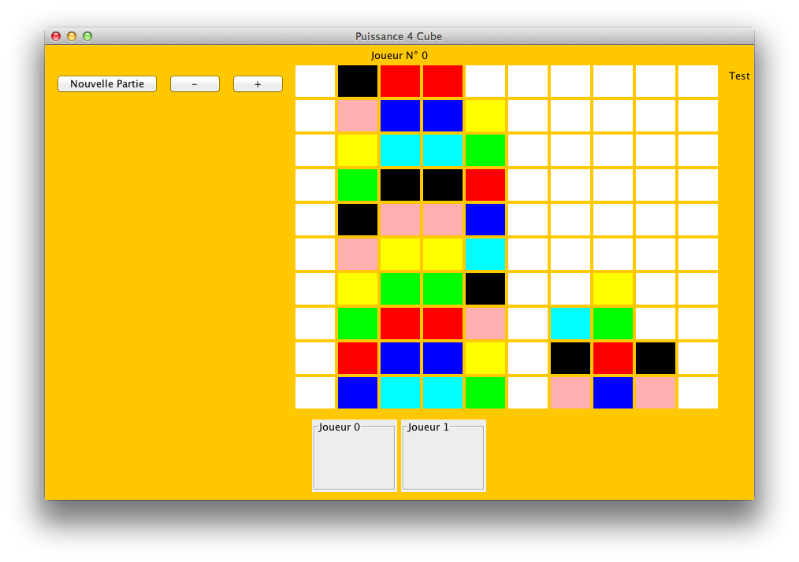

puissance_4_java
================

Attempt to create a clone of tic tac toe in JAVA + lwgjl

It s a simple Tic tac toe, written in java + swing

# Compile it :

```bash
git clone https://github.com/Hettomei/puissance_4_java.git
cd puissance_4_java
javac init/Start.java -d bin -encoding UTF8
```

# Run it

```bash
cd bin
java init.Start
```

# ScreenShot


# Other

It was coded in french.. Sorry
